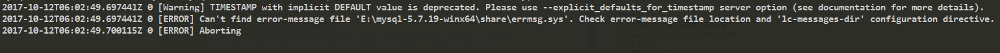
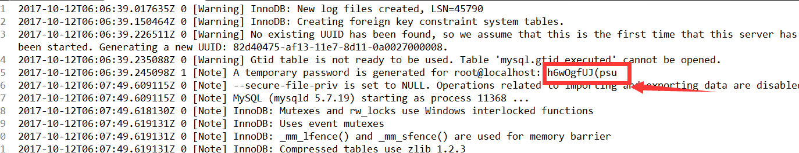

# Mysql升级安装5.7.19（windows phpStudy）

## 1、下载安装包
##### 前往官网下载windows的zip包，下载地址：
> https://dev.mysql.com/downloads/mysql/
##### 下载完成解压放至安装目录（如：D:\phpStudy）
## 2、创建mysql配置文件my.ini
#### 进入mysql安装目录（如：cd D:\phpStudy\mysql）
#### 创建my.ini（新版本不带my.ini）内容如下：
```cmd
 [mysql]
 # 设置mysql客户端默认字符集
 default-character-set=utf8
 [mysqld]
 #设置3306端口
 port = 3306
 # 设置mysql的安装目录
 basedir=D:\phpStudy\MySQL
 # 设置mysql数据库的数据的存放目录
 datadir=D:\phpStudy\MySQL\data
 # 允许最大连接数
 max_connections=200
 # 服务端使用的字符集默认为8比特编码的latin1字符集
 character-set-server=utf8
 # 创建新表时将使用的默认存储引擎
 default-storage-engine=INNODB
 # 开启查询缓存 	这是后来配置的 没有的话mysqld --initialize初始化报错data目录生成会有问题 导致以后步骤难以进行
 explicit_defaults_for_timestamp=true
```
## 3、初始化Mysql并安装
```cmd
mysqld --initialize   #直接初始化mysql，生成data文件夹中的文件。
mysqld -install          #安装mysql
net start mysql          #启动服务器
```
>note:我第一次安装是mysqld --initialize 报错如下：
```cmd
   2017-10-12T06:02:49.697441Z 0 [Warning] TIMESTAMP with implicit DEFAULT value is deprecated. Please use --explicit_defaults_for_timestamp server option (see documentation for more details).
   2017-10-12T06:02:49.697441Z 0 [ERROR] Can't find error-message file 'E:\mysql-5.7.19-winx64\share\errmsg.sys'. Check error-message file location and 'lc-messages-dir' configuration directive.
   2017-10-12T06:02:49.700115Z 0 [ERROR] Aborting
```

#### 关闭该警告在my.ini的[mysqld]加入下面配置：
```cmd
explicit_defaults_for_timestamp=true
```
## 4、登录mysql并重置密码
#### mysql -uroot -p 没有密码无法进入mysql
#### 查看mysql安装目录的data目录（D:\phpStudy\MySQL\data）的以.err结尾的文件发现有以下内容


#### 这就是mysql生成的一个随机密码 可以先用这个登录 
```cmd
2017-10-12T06:06:39.245098Z 1 [Note] A temporary password is generated for root@localhost: h6wOgfUJ(psu
```
#### 登录后重置密码
```cmd
ALTER USER 'root'@'localhost' IDENTIFIED BY '新密码';
```
#### 退出mysql并使用新密码登录验证是否可用
```mysql
mysql -uroot -p
```
#### 查看mysql版本
```mysql
select version();
```
## 5、添加mysql环境变量


#### Mysql5.7.19安装完成


