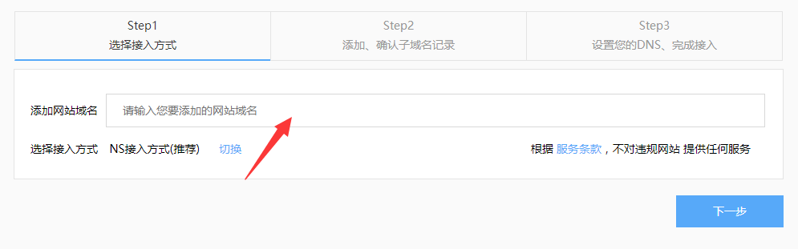
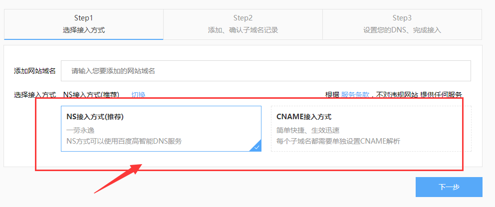
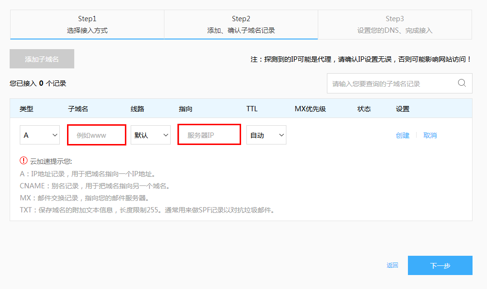
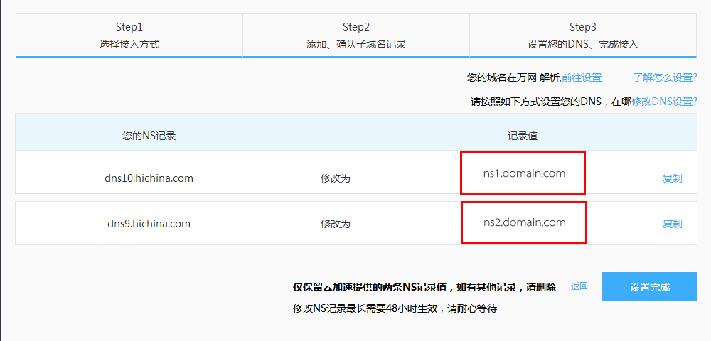
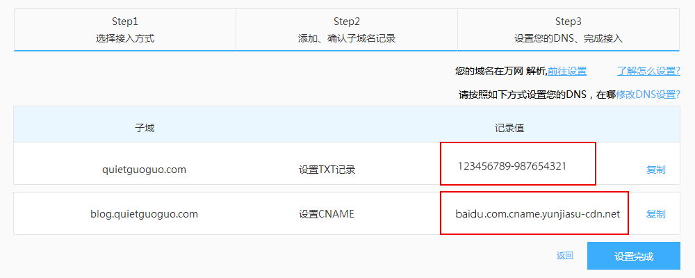
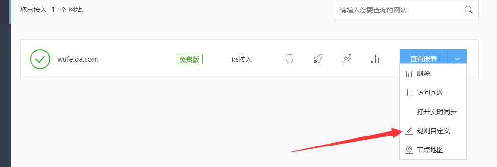
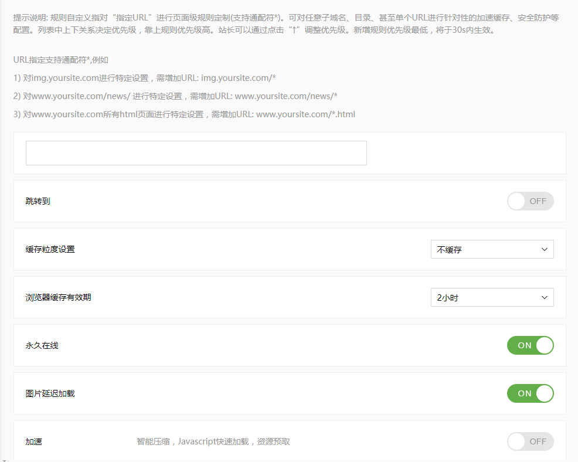
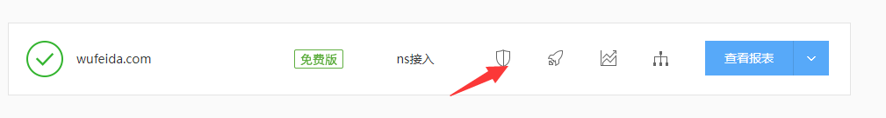

# 百度云加速（CDN加速）的使用
作为一个极客男，对网站性能总有极致的追求，由于我的是一个个人博客，不想专门为了CDN加速再做过多的投资，纵观各大云加速平台，免费好用的百度云算是良心之作，然后我将目标瞄向了百度云加速【奸笑】，今天讲讲百度云加速（CDN加速）的使用心得。希望能帮到各位！

> CDN的全称是Content Delivery Network，即内容分发网络。其基本思路是尽可能避开互联网上有可能影响数据传输速度和稳定性的瓶颈和环节，使内容传输得更快、更稳定。通过在网络各处放置节点服务器所构成的在现有的互联网基础之上的一层智能虚拟网络，CDN系统能够实时地根据网络流量和各节点的连接、负载状况以及到用户的距离和响应时间等综合信息将用户的请求重新导向离用户最近的服务节点上。其目的是使用户可就近取得所需内容，解决 Internet网络拥挤的状况，提高用户访问网站的响应速度。

## 一、登录百度云加速平台添加网站
1） 使用百度账号登录百度云加速平台，进入管理控制台，点击添加网站，填写要加速的域名，点击下一步。

有一点需要说明一下，这里有一个选择接入方式

   **1. NS（Name Server）表示域名的DNS服务器地址用来指定该域名由哪个DNS服务器来进行解析。常见的NS记录地址一般以以下的形式出现：ns1.domain.com。如果将NS设置为“ns1.domain.com”，则我们网站域名下的所有子域名的解析都将通过该NS服务器（ns1.domain.com）进行解析。**
   
   **2. CNAME指别名记录也被称为规范名字。它是DNS的一种解析方式，表示将某个域名指向另一个域名。换言之，只有我们确定好了域名的DNS服务器后才可以写入CNAME记录。**
这两种方式各有利弊，NS接入可以使用百度提供的高智能DNS服务，CNAME接入无法获得百度云加速的高防服务，相比于NS接入，CNAME接入方式需要对每一个单独的子域名单独进行设置，并且生效快。我们需要根据个人的实际情况选择适合自己的接入方式。

2） 填写完成域名后，点击下一步，我们需要接入至少一条子域名记录，服务器IP地址则需要指向你网站的服务器，具体IP可以咨询你的服务器提供商或者去服务器后台查看。（这步NS和CNAME一样）

3）设置完子域名后，点击下一步，这里有存在两种情况：

①NS接入：百度会提供两个DNS地址，我们只需要将这两个地址替换掉原有的DNS即可。NS接入方式所需的时间比较长，我们需要等待一段时间后方可看到接入成功的提示。

②CNAME接入：添加好子域名后，百度云加速会给我们两条记录值，一条是TXT记录，另一条是CNAME记录，其中TXT记录主要是用于验证网站所有权的，而CNAME是用来做别名解析的，对于使用阿里云虚拟主机的小伙伴们，我们可能遇到TXT记录与CNAME记录冲突的情况，这时候我们只需要先设置好TXT记录并进入百度云加速验证完成后再删除掉TXT记录，添加上CNAME记录即可。

## 二、设置百度云加速（自定义规则设置）
添加网站之后，我们需要设置自定义规则，才能使CDN加速发挥到最大效果（免费版可定制3条页面规则）

点击之后我们看到下面这样页面

1） url输入框：这里百度上面提示的很清楚，
URL指定支持通配符*,例如   

      1) 对img.yoursite.com进行特定设置，需增加URL: img.yoursite.com/*
      
      2) 对www.yoursite.com/news/ 进行特定设置，需增加URL: www.yoursite.com/news/*
      
      3) 对www.yoursite.com所有html页面进行特定设置，需增加URL: www.yoursite.com/*.html

2） 跳转到：

A 触发URL：当用户访问该URL后发生跳转；假如您是要配置访问“www.abc.com” 跳转到 “abc.com”，请在这里填写”www.abc.com/*”。

B 目标URL：当用户触发跳转后的目标URL；假如您是要配置访问“www.abc.com” 跳转到 “abc.com”，请在这里填写”http://abc.com”。
       
C 跳转方式选择：提供301永久跳转和302临时跳转；
       
       ● *301永久跳转：表示该页面永久的转向了另外一个页面。
       ● *302临时跳转：表示该页面临时转向到另外一个地址。
       对于用户来讲，看见的都是一个重定向，但是301有利于SEO优化。
3）缓存粒度设置：

A 不缓存：就是什么都不用缓存。

B 基础：缓存基本的静态文件。

C 简单：缓存静态文件，忽略参数

D 细致：根据不同参数缓存

F 所有都缓存：不管动态静态数据都缓存
                       
解释：细致缓存其实就是只缓存静态文件，其中缓存时间或有效期请自行设定即可。另外由于百度云加速不能对单个域名设置，所以最后的缓存规则是前后通配，保证某些网站的二级静态域名也缓存到位。因为我网站前台有登录功能，如果设置所有都缓存后，前台的登录状态就不能实时获取，所以我这里设置的是细致缓存，如果你的网站是纯静态网站，就可以设置所有都缓存。

4）浏览器缓存有效期：用户浏览器缓存失效时间。

5） 图片延迟加载：通过异步加载的方式来避免传输阻塞，从而提升用户访问速度。

    *该功能不适宜全部类型网站，请在开启后确认图片加载是否正常。
6） 加速：智能压缩，Javascript快速加载，资源预取。

    *该功能不适宜全部类型网站，请在开启后确认图片加载是否正常。
7） javascript快速加载
 
    *该功能不适宜全部类型网站，请在开启后确认图片加载是否正常。
8）安全通用设置：一键开启WAF。WAF提供精确的网站指纹识别技术，对网站进行指纹识别同时提供高效的处理引擎， 结合实时更新的防御策略，覆盖OWASP主流的攻击类型。

9）CC防护：开启CC防护，通过百度自主开发的CC防御引擎，迅速阻断攻击IP

    * 强力防护：建议仅在正在受到CC攻击且防御不佳时开启
      高：系统会对所有2周内产生可疑行为的用户进行选择性拦截
      中：系统会智能识别出可疑请求，并且自动选择合适的认证方式（推荐）
      低：系统会对本次攻击中产生可疑行为的用户进行拦截
      关闭：系统只对灾难性攻击行为的用户进行安全拦截

10）浏览器检查：同WAF中浏览器检查功能一致。对于明显不是浏览器的访问请求予以拒绝，以防止恶意抓取和垃圾信息

对于8,9,10这三点，可从我的网站列表，安全按钮点击进入设置

规则列表：这里显示您所自定义规则的条目数，优先级配置也是在这里，最上面是优先级
最高的规则，往下逐步降低。
每一条规则配置完成后点击右下角的提交促使规则生效。每次修改之后一般30s内生效。

## 三、百度云加速（CDN加速）效果查看
设置完成之后我们需要知道到底设置成功了没，查看方式如下：
    
   *给网站使用CDN后，查看访问网站是否命中CDN缓存，用浏览器简单访问测试就可以看到。查看方法如下：1、使用谷歌chrome或者火狐浏览器，在浏览器界面，按F12，打开浏览器调试界面，然后选择“网络”或者是“Network”。 2、然后访问一个网站链接，在浏览器中进行访问，查看显示的信息。主要查看响应头信息中的“X-Cache”字段。显示“MISS”，说明没有命中CDN缓存，是回源的。显示“HIT”，是命中了CDN缓存。如果你设置的是细致缓存或者只缓存静态，我们需要看静态资源的命中效果。*

至此，快去看看你的网站速度提升了没！！！