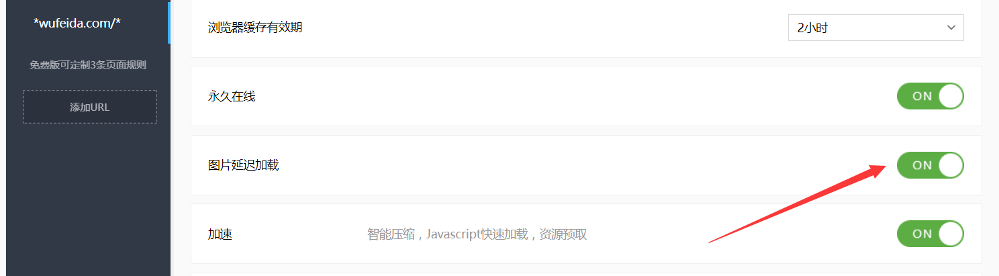

# 百度云加速踩坑日记1-图片延迟加载的坑

## 挖坑：
为了让广大村民同志们更清晰真实的看到图片，我的网站使用了``photoswipe``插件，这是一个图片查看插件，使用过这个插件的都知道，需要给``img``标签父级a标签添加``data-size``属性，值就是图片的宽x高，我这里使用js动态的给所有img父级a标签添加这个属性
```javascript
function auto_data_size(){
    $(".am-article-bd img").each(function() {
        var imgs = new Image();
        imgs.src=$(this).attr("src");
        var w = imgs.width,
            h =imgs.height;
        $(this).parent("a").attr("data-size",w+"x"+h);
    })
};
```
在这里pc端没有任何问题，宽高可以获取，但是用手机浏览，图片就点不开，用谷歌浏览器切换到手机模拟查看源码，发现了问题，``data-size``全部是0x0，这个肯定就有问题，但是为啥电脑端就没事呢？

## 填坑
这个问题纠结了好久，反复看手机端源码之后，在``img``标签里面发现了一个``data-cfsrc``属性，属性值就是图片的地址，我的代码里压根没有写过这个属性啊，怎么会多出来这个属性，仔细想了想，会不会百度云加速所影响的，记得当时加速的时候设置了一个图片延迟加载，会不会是它在作祟，我带着疑问去百度云加速后台查看设置，果然在自定义规则里面看见了图片延迟加载这个选项，该选项我是开启的，我直接关闭后完美解决！


## 理解
因为我的js需要获取每一个图片的地址，也就是每个``img``里面的``src``的值，根据图片地址获取图片的宽和高。但是当我们在云加速设置了图片延迟加载后，等网页所有元素都加载完成之后才开始加载图片（可以加快网页显示速度，提升用户体验），也就是说这个设置会将你的``src``先设置为``data-cfsrc``这个属性，等网页``onload``之后再将``data-cfsrc``的值赋给``src``，所以才会导致js获取到图片的宽高都是0。所以当网页其他元素加载完成之后，那段动态添加属性的js也已经执行完了，但当时``src``是 没有值的，那段js压根就没有获取到图片地址。

## 总结

图片延迟加载并不是所有网站都可以设置，尤其是对于那些处理网页图片的网站，设置完之后切记要检查网站显示有没有问题。