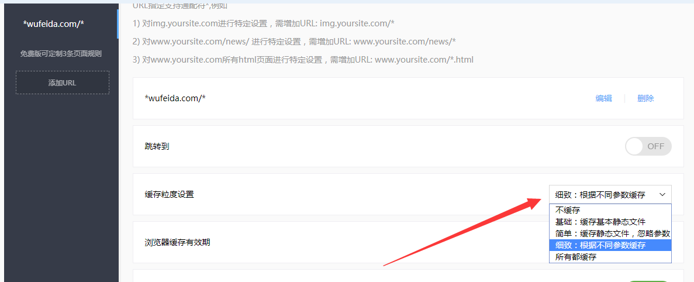

# 百度云加速踩坑日记2-缓存粒度设置所有都缓存的坑
> 作为一个极客男，总是会对一些东西追求完美，当然，追求的过程总是要付出一些代价的。
## 挖坑
刚开始接触百度云加速这个东西，

没有认真看解释和百度教程，

一心只想着让我的网站打开速度更快点，

所以上来就将``缓存粒度设置``设置成``所有都缓存``，

心想这样一来可以减缓我服务器的压力，

二来可以让全国各地的广大撸友同志享受到飞一样的快感。

但我却忽略了最最最重要的一点，

我的网站是一个 **动态** **动态** **动态** 网站，

当我设置``所有都缓存``之后，

我的服务器压力是小了（其实基本没有压力了【奸笑】），

打开速度也是飞一般的感觉（此处有一首汪峰的【勇敢的心】送给各位撸友），

当我正心中窃喜百度云加速给我网站带来飞一样的速度时，

一个big bug正向我慢慢走来（它也是是没有一点预兆的，猝不及防的），

我的网站有一个登录功能，

撸友登录后可以发表一些评论和建议，

当我测试登录评论的时候，

登录后重新回到之前浏览的那个页面，

看上去一切都很正常，

仔细一看，右上角赫然显示着两个字 **登录**（纳尼），

如果用户登录后这里应该显示的是用户的昵称和头像的，

但是网站像是什么都没有发生过一样，

登录信息什么都没有，

当我点击另外一个页面，

这个页面却显示已经登录，

我再次返回上个页面不管我怎么刷新都显示的是没有登录，

这个问题特别诡异啊！
## 填坑
我百度云加速设置的是全部缓存，

所以不管你是动态还是静态内容，

只要你第一次进入页面，

这个页面的所有内容百度云加速都会给你缓存，

当你在这个页面登录后，重新跳回到这个页面时，

百度云加速会直接返回缓存的页面，

所以这里的登录状态是无法获取的，

除非你在百度云后台清除缓存，

我最后将``缓存粒度设置``改成细致缓存（迫不得已），

也就是只缓存静态资源解决问题。

## 理解
百度云缓存粒度设置的理解

**A** 不缓存：就是什么都不用缓存。

**B** 基础：缓存基本的静态文件。

**C** 简单：缓存静态文件，忽略参数

**D** 细致：根据不同参数缓存

**F** 所有都缓存：不管动态静态数据都缓存
                       
*解释：细致缓存其实就是只缓存静态文件，其中缓存时间或有效期请自行设定即可。另外由于百度云加速不能对单个域名设置，所以最后的缓存规则是前后通配，保证某些网站的二级静态域名也缓存到位。因为我网站前台有登录功能，如果设置所有都缓存后，前台的登录状态就不能实时获取，所以我这里设置的是细致缓存，如果你的网站是纯静态网站，就可以设置所有都缓存。*

## 总结

追求极致和完美是没错，但追求完美的同时要保证项目的正常运行。如果你的前台页面是纯静态页面，设置所有都缓存是完全没问题的，但是前台要是有实时动态获取的内容（比如登录），建议缓存粒度设置成细致缓存，其实我们网站加载的时间的90%都是在下载一些静态的资源，所以只用把那些静态资源缓存了，网站速度就会有一个很大的提升。