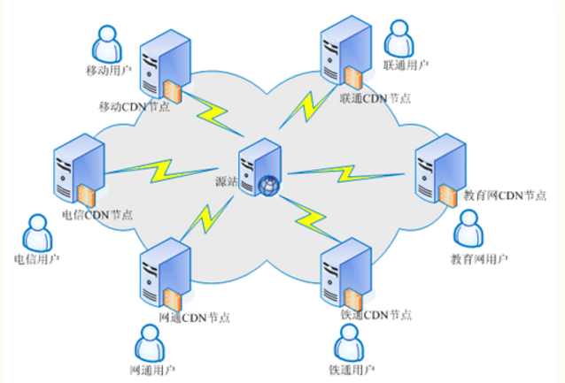
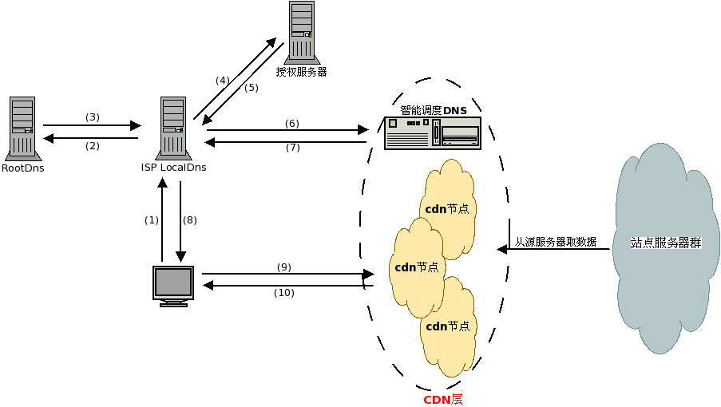

# CDN及CDN加速原理
> 在不同地域的用户访问网站的响应速度存在差异,为了提高用户访问的响应速度、优化现有Internet中信息的流动,需要在用户和服务器间加入中间层CDN. 使用户能以最快的速度，从最接近用户的地方获得所需的信息，彻底解决网络拥塞，提高响应速度，是目前大型网站使用的流行的应用方案.
## 1. CDN 概述
> CDN的全称是Content Delivery Network，即内容分发网络。其目的是通过在现有的Internet中增加一层新的CACHE(缓存)层，将网站的内容发布到最接近用户的网络”边缘“的节点，使用户可以就近取得所需的内容，提高用户访问网站的响应速度。从技术上全面解决由于网络带宽小、用户访问量大、网点分布不均等原因，提高用户访问网站的响应速度。



Cache层的技术，消除数据峰值访问造成的结点设备阻塞。Cache服务器具有缓存功能，所以大部分网页对象（Web page object）,如html, htm, php等页面文件，gif,tif,png,bmp等图片文件，以及其他格式的文件，在有效期（TTL）内，对于重复的访问，不必从原始网站重新传送文件实体, 只需通过简单的认证（Freshness Validation）- 传送几十字节的Header，即可将本地的副本直接传送给访问者。由于缓存服务器通常部署在靠近用户端，所以能获得近似局域网的响应速度，并有效减少广域带宽的消耗。不仅能提高响应速度，节约带宽，对于加速Web服务器，有效减轻源服务器的负载是非常有效的。

根据加速对象不同，分为客户端加速和服务器加速

- **客户端加速** : Cache部署在网络出口处，把常访问的内容缓存在本地，提高响应速度和节约带宽；
- **服务器加速** : Cache部署在服务器前端，作为Web服务器的代理缓存机，提高Web服务器的性能，加速访问速度。 如果多台Cache加速服务器且分布在不同地域，需要通过有效地机制管理Cache网络，引导用户就近访问(比如通过DNS引导用户)，全局负载均衡流量，这是CDN内容传输网络的基本思想。

CDN对网络的优化作用主要体现在如下几个方面 　

- 解决服务器端的“第一公里”问题 　
- 缓解甚至消除了不同运营商之间互联的瓶颈造成的影响 
- 减轻了各省的出口带宽压力
- 缓解了骨干网的压力
- 优化了网上热点内容的分布

## 2. CDN 的工作原理
### 2.1. 传统访问过程(未加速缓存服务)
我们先看传统的未加缓存服务的访问过程，以便了解CDN缓存访问方式与未加缓存访问方式的差别： 


由上图可见，用户访问未使用CDN缓存网站的过程为:

1. 用户输入访问的域名,操作系统向 LocalDns 查询域名的ip地址
2. LocalDns向 ROOT DNS 查询域名的授权服务器(这里假设LocalDns缓存过期)
3. ROOT DNS将域名授权dns记录回应给 LocalDns
4. LocalDns得到域名的授权dns记录后,继续向域名授权dns查询域名的ip地址
5. 域名授权dns 查询域名记录后，回应给 LocalDns
6. LocalDns 将得到的域名ip地址，回应给 用户端
7. 用户得到域名ip地址后，访问站点服务器
8. 站点服务器应答请求，将内容返回给客户端.
### 2.2. CDN访问过程(使用缓存服务)
CDN网络是在用户和服务器之间增加Cache层，主要是通过接管DNS实现,将用户的请求引导到Cache上获得源服务器的数据。下面让我们看看访问使用CDN缓存后的网站的过程： 


通过上图，我们可以了解到，使用了CDN缓存后的网站的访问过程变为：

1. 用户输入访问的域名,操作系统向 LocalDns 查询域名的ip地址.
2. LocalDns向 ROOT DNS 查询域名的授权服务器(这里假设LocalDns缓存过期)
3. ROOT DNS将域名授权dns记录回应给 LocalDns
4. LocalDns得到域名的授权dns记录后,继续向域名授权dns查询域名的ip地址
5. 域名授权dns 查询域名记录后(一般是CNAME)，回应给 LocalDns
6. LocalDns 得到域名记录后,向智能调度DNS查询域名的ip地址
7. 智能调度DNS 根据一定的算法和策略(比如静态拓扑，容量等),将最适合的CDN节点ip地址回应给 LocalDns
8. LocalDns 将得到的域名ip地址，回应给 用户端
9. 用户得到域名ip地址后，访问站点服务器
10. CDN节点服务器应答请求，将内容返回给客户端.(缓存服务器一方面在本地进行保存，以备以后使用，二方面把获取的数据返回给客户端，完成数据服务过程)

通过以上的分析我们可以得到，为了实现对普通用户透明(使用缓存后用户客户端无需进行任何设置)访问，需要使用DNS(域名解析)来引导用户来访问Cache服务器，以实现透明的加速服务. 由于用户访问网站的第一步就是域名解析,所以通过修改dns来引导用户访问是最简单有效的方式.

### 2.3. CDN网络的组成要素
对于普通的Internet用户，每个CDN节点就相当于一个放置在它周围的网站服务器. 通过对dns的接管，用户的请求被透明地指向离他最近的节点，节点中CDN服务器会像网站的原始服务器一样，响应用户的请求. 由于它离用户更近，因而响应时间必然更快.

从上面图中 虚线圈起来的那块，就是CDN层,这层是位于 用户端 和 站点服务器 之间.

- 智能调度DNS(比如f5的3DNS) 
  智能调度DNS是CDN服务中的关键系统.当用户访问加入CDN服务的网站时，域名解析请求将最终由 “智能调度DNS”负责处理。它通过一组预先定义好的策略，将当时最接近用户的节点地址提供给用户，使用户可以得到快速的服务。同时它需要与分布在各地的CDN节点保持通信，跟踪各节点的健康状态、容量等信息，确保将用户的请求分配到就近可用的节点上.
- 缓存功能服务 负载均衡设备(如lvs,F5的BIG/IP) 内容Cache服务器(如squid） 共享存储(根据缓存数据量多少决定是否需要)
    
## 3. CDN 智能调度Dns 实例分析
### 3.1 分析img.alibaba.com域名
在系统中，执行dig命令,输出如下:
```cmd
#dig img.alibaba.com   

; 部分省略

;; QUESTION SECTION:
;img.alibaba.com.       IN  A

;; ANSWER SECTION:
img.alibaba.com.    600 IN  CNAME   img.alibaba.com.edgesuite.net.
img.alibaba.com.edgesuite.net. 7191 IN  CNAME   img.alibaba.com.georedirector.akadns.net.
img.alibaba.com.georedirector.akadns.net. 3592 IN CNAME a1366.g.akamai.net.
a1366.g.akamai.net. 12  IN  A   204.203.18.145
a1366.g.akamai.net. 12  IN  A   204.203.18.160

; 部分省略
```
从上面查询结果可以看出 img.alibaba.com. CNAME img.alibaba.com.edgesuite.net. 后面的CNAME是由 Akamai(CDN服务商) 去跳转到 智能调度器上的.

### 3.2 分析www.discovery.com域名

在系统中，继续执行dig命令,输出如下:

```cmd
#dig www.discovery.com

; 部分省略

;; QUESTION SECTION:
;www.discovery.com.     IN  A

;; ANSWER SECTION:
www.discovery.com.  1077    IN  CNAME   www.discovery.com.edgesuite.net.
www.discovery.com.edgesuite.net. 21477 IN CNAME a212.g.akamai.net.
a212.g.akamai.net.  20  IN  A   204.203.18.154
a212.g.akamai.net.  20  IN  A   204.203.18.147

; 部分省略
```
从上面查询结果可以看出 www.discovery.com. IN CNAME www.discovery.com.edgesuite.net. 后面的CNAME是由 Akamai(CDN服务商) 去跳转到 智能调度器上的.

**总结:** 一般来说，网站需要使用到CDN服务时，一般都是将需要加速访问的域名 CNAME到 CDN服务商的域名上。缓存服务和调度功能都是由服务商来完成。
## 4. CDN的 智能调度Dns 简化实现
### 4.1. 调度策略说明
在用户请求解析域名的时候，智能DNS判断用户的LocalDns的IP，然后跟DNS服务器内部的IP表范围匹配一下，看看用户是电信还是网通用户，然后给用户返回对应的IP地址。这里使用的是静态拓扑的方法,只是判断LocalDns的IP.要想使用更复杂的调度算法可以考虑商业产品,如F5的3DNS。
### 4.2. 假设CDN节点规划
在这里我们将使用 BIND 的View功能来实现运营商的区分,假设我们在每个运营商的机房都放有一个CDN节点,列表如下:

域名 | 运营商（view） | 服务地址
----|------|----
www.cdntest.com | 网通(CNC)  | 192.168.0.1
www.cdntest.com | 电信(TELECOM)  | 192.168.0.2
www.cdntest.com | 教育网(EDU)  | 192.168.0.3
www.cdntest.com | 默认(ANY) | 192.168.0.4
### 4.3. bind view 配置
以下是named.conf配置文件的部分截取，只是涉及到 View 的部分,其他细节可参考互联网.

```cmd
acl "cnc_iprange"{   //定义ip范围(网通)
192.168.1.0/24;  
192.168.2.0/24;
//此处只是示例,其他省略
};  

acl "tel_iprange"{  //定义ip范围(电信)
192.168.3.0/24;  
192.168.4.0/24;
//其他省略
};

acl "edu_iprange"{  //定义ip范围(教育网)
192.168.5.0/24;  
192.168.6.0/24;
//其他省略
};

acl "default_iprange"{ //定义ip范围(默认)
192.168.7.0/24;  
192.168.8.0/24;
//其他省略
}; 


view "CNC" {
    Match-clients{cnc_iprange};
    zone "." IN {
        type hint;
        file "named.root";
    };

    zone "localhost" IN {
        type master;
        file "localhost.zone";
        allow-update { none; };
    };

    zone "cdntest.com" IN {
        type master;
        file "cnc_cdntest.zone";
    };
};

view "TEL" {
    Match-clients{tel_iprange};
    zone "." IN {
        type hint;
        file "named.root";
    };

    zone "localhost" IN {
        type master;
        file "localhost.zone";
        allow-update { none; };
    };

    zone "cdntest.com" IN {
        type master;
        file "tel_cdntest.zone";
    };
};

view "EDU" {
    Match-clients{edu_iprange};
    zone "." IN {
        type hint;
        file "named.root";
    };

    zone "localhost" IN {
        type master;
        file "localhost.zone";
        allow-update { none; };
    };

    zone "cdntest.com" IN {
        type master;
        file "edu_cdntest.zone";
    };
};

view "DEFAULT" {
    Match-clients{default_iprange};
    zone "." IN {
        type hint;
        file "named.root";
    };

    zone "localhost" IN {
        type master;
        file "localhost.zone";
        allow-update { none; };
    };

    zone "cdntest.com" IN {
        type master;
        file "default_cdntest.zone";
    };
};
```
**zone文件的配置说明**
这4个zone配置文件(cnc_cdntest.zone,tel_cdntest.zone,edu_cdntest.zone,default_cdntest.zone)中，只有www.cndtest.com的A记录不一样，其他的都是一样.

域名 | zone配置文件 | A记录地址
----|------|----
www.cdntest.com | cnc_cdntest.zone | 192.168.0.1
www.cdntest.com | 	tel_cdntest.zone | 192.168.0.2
www.cdntest.com | edu_cdntest.zone  | 192.168.0.3
www.cdntest.com | 	default_cdntest.zone | 192.168.0.4

以上只列出了 www.cdntest.com 的A记录地址,其他关于zone的语法 请参考互联网.

**域名解析流程简要说明**
1. 用户向 LocalDns 查询域名 www.cdntest.com
2. LocalDns 向 授权DNS 查询www.cdntest.com
3. 授权DNS 判断用户使用的 LocalDns的ip地址,匹配上述设置的ip范围,如果范围在网通，就将网通对应的ip地址(192.168.0.1),回应给LocalDns(其他依此类推)
4. LocalDns 将得到的域名ip地址，回应给 用户端 (域名解析完成)

**说明：** 再此过程中，我们简化了主**DNS** 到 **智能DNS** 之间的CNAME过程(为了简要说明问题). 
        这里使用的是静态拓扑(根据ip范围)的方法,也称为**地域化** 方法,只是判断LocalDns的IP.
 
 **此简化方案中的存在的问题**
 
1. 如果用户设置错误的dns，可能会导致用户访问比原来慢(比如网通用户设置了电信的DNS）
2. 不能判断CDN节点服务器的健康状态和容量状态，可能会把用户定向到不可用的CDN节点
3. 由于静态拓扑方法,可能存在用户访问的CDN节点不是最优化和最快的
4. …..可能还有其他想不到的….

## 5. 总结(Summary）

- 在建立CDN网路时，最关键的就是 智能调度DNS，这个是CND网络总协调,通过高效的调度算法，可以使用户得到最佳的访问体验.
- 其次就是 CND节点的管理,比如涉及到 内容的同步机制，配置文件的更新等等，都需要有一套机制来保证.
- 当然在大型网站中，也要考建设CDN体系的成本和回报率.
