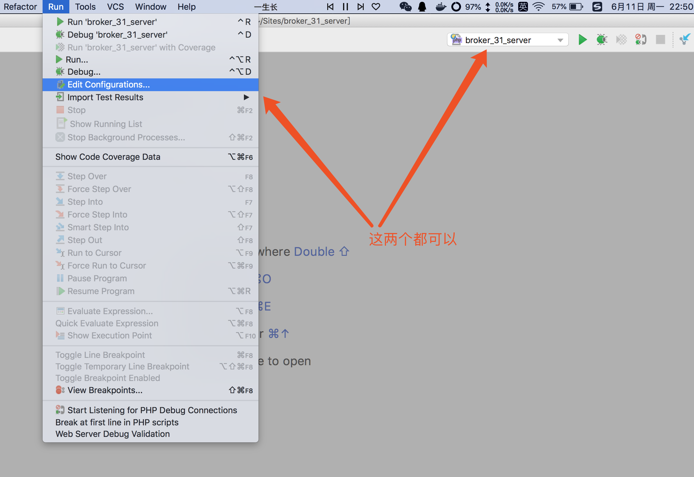
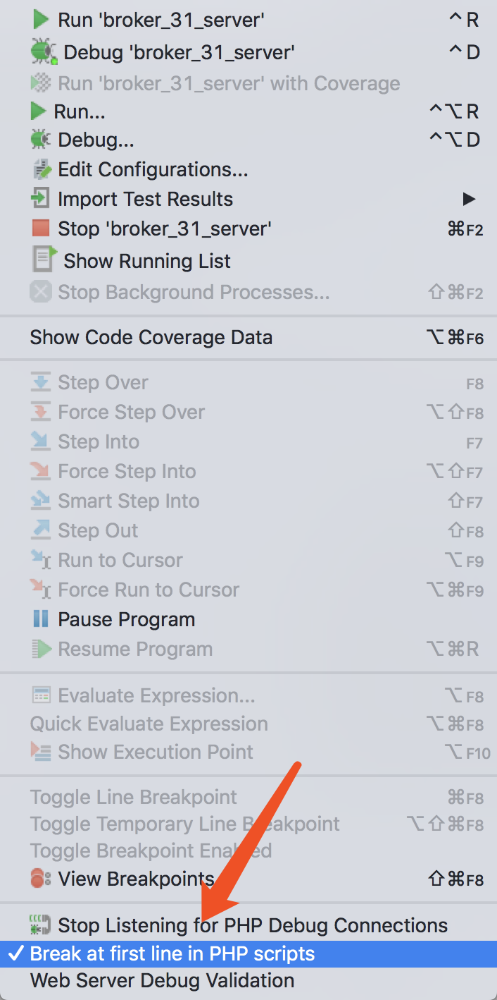
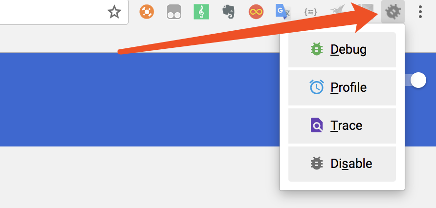

# Phpstorm使用xdebug调试
> Xdebug是一个开放源代码的PHP程序调试器(即一个Debug工具)，可以用来跟踪，调试和分析PHP程序的运行状况。Xdebug现在的最新版本是Xdebug 2.4.0RC4,release日期 2016-01-25，添加了对PHP7的支持！
## 一、安装xdebug

安装xdebug我们使用官网推荐的方式，通过``pecl``安装，官网[文档](https://xdebug.org/docs/install)

> PEAR 是“PHP Extension and Application Repository”的缩写，即PHP扩展和应用仓库。
> PEAR 将PHP程序开发过程中常用的功能编写成类库，涵盖了页面呈现、数据库访问、文件操作、数据结构、缓存操作、网络协议、WebService 等许多方面，用户可以通过下载这些类库并适当的作一些定制以实现自己需要的功能。避免重复发明“车轮”。PEAR 的出现大大提高了PHP 程序的开发效率和开发质量。

>PECL 是“PHP Extension Community Library”的缩写，即PHP 扩展库。
  
>PECL 可以看作PEAR 的一个组成部分，提供了与PEAR 类似的功能。不同的是PEAR的所有扩展都是用纯粹的PHP代码编写的，用户在下载到PEAR 扩展以后可以直接使用将扩展的代码包含到自己的PHP 文件中使用。而PECL是使用C 语言开发的，通常用于补充一些用PHP难以完成的底层功能，往往需要重新编译或者在配置文件中设置后才能在用户自己的代码中使用。
  
>php学习总结：最直接的表述：PEAR是PHP的上层扩展，PECL是PHP的底层扩展。它们都是为特定的应用提供现成的函数或者类。

执行命令
```
pecl install xdebug
```

等待编译安装完成，到最后一步时出现问题，提示``Operation not permitted``，我们这里用sudo也不行，百度之后，原来有很多人都遇到这种问题
这是因为Mac OS X El Capitan系统的升级，启用了更高的安全性保护机制：系统完整性保护System Integrity Protection (SIP)。简单来讲就是更加强制性的保护系统相关的文件夹。开发者不能直接操作相关的文件内容。

#### 解决方案
  - 重启系统
  - 按住 Command + R 进入 Recoverary 模式
  - 点击 实用工具 > 终端
  - 输入 ``csrutil disable``
  - 重启系统
  tips:xdebug安装完成之后可以执行``csrutil enable``重新开启SIP，保护系统安全。

我们这里关闭SIP，然后重新运行``pecl install xdebug``，顺利完成。

## 二、配置php.ini
在php.ini后面添加如下内容
```
[xdebug]
zend_extension="/usr/lib/php/extensions/no-debug-non-zts-20160303/xdebug.so"
xdebug.remote_enable=1        //必须开启远程连接
xdebug.remote_host=127.0.0.1  //本地host
xdebug.remote_port=9000       //默认使用9000端口
xdebug.idekey=PHPSTORM        //idekey，调试时候使用
```
配置完成之后重启php，使用``phpinfo``查看是否成功加载xdebug插件


## 三、配置phpstorm

打开 PHPStorm，首先配置 PHP 的使用版本与 CLI Interpreter

``Preferences => Language & Frameworks -> PHP``，选项如下：

``PHP language level`` ：选择 PHP 的使用版本

``CLI Interpreter`` : 配置 PHP 可执行文件的位置


这里选择了php命令位置后，会自动识别出是否安装xdebug以及版本，也是一个xdebug安装是否成功的参考。

接着我们选择``Servers``，点击加号，添加一项
 - Name：可以命名自己喜欢的名字
 - Host：要调试的host，我这里填写自己本地host
 - Port：是网站端口，不是xdebug端口，我们这里默认80
 - Debugger：这里肯定选择xdebug


配置完成后我们选择``Debug``，配置xdebug

在xdebug选项下
 - debug port：填写自己刚刚在php.ini中配置的xdebug端口号，一定要一致
 - force break at first line ... 下面这两选取消前面的对勾，如果不取消每次都会从框架最开始位置调试，并非自己打断点的位置。
 


保存关闭``Preferences``

接着配置``Run => Edit configurations``



在新开的页面点击左上角的加号，添加``PHP Web Page``
 - Name：填写自己项目名称，随意就好
 - Server：选择刚刚在``Servers``添加的那条数据。
 - Start URL：开始url，这里就是点击调试之后打开的地址
 - Browser：使用Chrome浏览器作为调试浏览器

保存完成。


配置就到此完成

## 四、使用xdebug调试程序

phpstorm打断点相当方便，只需在想要断点程序的下一行的行号后点击一下，出现一个红点并且本行就变成红色，断点就已经打上。因为打了断点的那行代码不会执行，所以要在打断点的下一行打断点。


打好断点之后，点击右上角臭虫，就可以调试了


问题不出意料的再次出现，xdebug是运行了，但是没有出现在我们打断点的位置，而是框架的起始位置，我们当时专门取消了``Debug``里面的那两个选项，怎么还是从框架的其实位置开始。经过长时间的google，终于找到问题，原来在``Run => Break at first line in php scripts``依然是选择状态，将前面的√去掉就OK了，这个问题困扰了我好长时间，希望你们不要踩坑。



重新点击臭虫进行调试，终于成功！


这里在控制台我们可以看到变量以及参数的所有信息，特别方便调试，减少了使用echo，var_dump和laravel框架里面的dd(),dump()；

## 五、配合postman调试

由于我们的项目写的大部分是接口，需要使用postman进行调试和请求，这时我们只需要打开debug监听，也就是phpstorm右上角那个打电话的标志。每次使用postman请求的时候，链接后面加一个参数``http://hostname.com?XDEBUG_SESSION_START=PHPSTORM``，每次请求之后会自动跳转到phpstorm，以便查看调试信息，方便至极。


## 六、配合Chrome调试

在Chrome应用商店，搜索``Xdebug helper``，进行安装



每次使用时候，选择打开``Debug``，phpstorm打开监听，请求之后自动调试，同样方便。

至此xdebug安装完成！

test 一下


