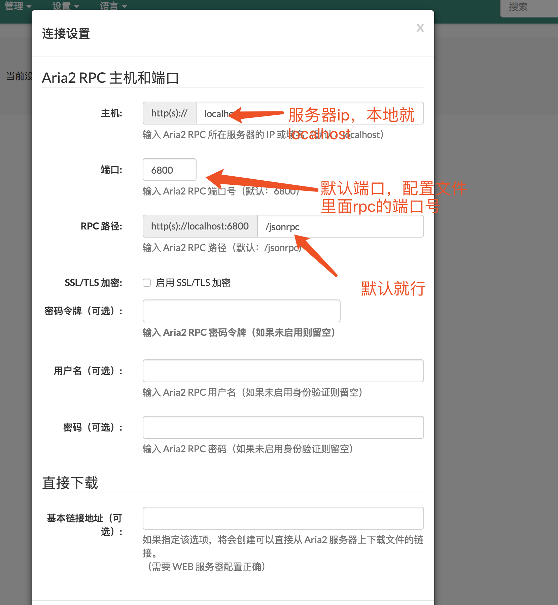

# Mac上配置aria2下载器

> 是一款开源、轻量级的多协议命令行下载工具，支持 HTTP/HTTPS、FTP、SFTP、BitTorrent 和 Metalink 协议，拥有众多第三方支持插件，被誉为「下一代下载工具」和「下载神器」，然而由于安装配置复杂，挡住了许多人的使用。

## 使用理由

由于百度网盘下载限速以及mac上迅雷比较鸡肋，为了解决下载限速，使用aria2进行下载。

## 安装aria2

[官网](https://aria2.github.io/)下载安装

安装过程不在赘述，mac可以使用``homebrew``安装，或者直接下载安装包安装

## 安装chrome插件

下载[BaiduExporter.crx](https://github.com/acgotaku/BaiduExporter) chrome浏览器插件，打开浏览器的``设置->更多工具->扩展程序``，将刚刚下载的``crx``文件拖到浏览器，自动识别安装。如图


拖动到此页面之后提示如图：


点击添加扩展程序，即可安装成功。

## 配置aria2

进入家目录，新建``.aria2``目录，并将配置文件``aria.conf``添加进去，``aria.conf``文件配置内容如下：

```bash
## '#'开头为注释内容, 选项都有相应的注释说明, 根据需要修改 ##
## 被注释的选项填写的是默认值, 建议在需要修改时再取消注释  ##

## 文件保存相关 ##

# 文件的保存路径(可使用绝对路径或相对路径), 默认: 当前启动位置
dir=~/downloads
# 启用磁盘缓存, 0为禁用缓存, 需1.16以上版本, 默认:16M
#disk-cache=32M
# 文件预分配方式, 能有效降低磁盘碎片, 默认:prealloc
# 预分配所需时间: none < falloc ? trunc < prealloc
# falloc和trunc则需要文件系统和内核支持
# NTFS建议使用falloc, EXT3/4建议trunc, MAC 下需要注释此项
#file-allocation=none
# 断点续传
continue=true

## 下载连接相关 ##

# 最大同时下载任务数, 运行时可修改, 默认:5
#max-concurrent-downloads=5
# 同一服务器连接数, 添加时可指定, 默认:1
max-connection-per-server=5
# 最小文件分片大小, 添加时可指定, 取值范围1M -1024M, 默认:20M
# 假定size=10M, 文件为20MiB 则使用两个来源下载; 文件为15MiB 则使用一个来源下载
min-split-size=10M
# 单个任务最大线程数, 添加时可指定, 默认:5
#split=5
# 整体下载速度限制, 运行时可修改, 默认:0
#max-overall-download-limit=0
# 单个任务下载速度限制, 默认:0
#max-download-limit=0
# 整体上传速度限制, 运行时可修改, 默认:0
#max-overall-upload-limit=0
# 单个任务上传速度限制, 默认:0
#max-upload-limit=0
# 禁用IPv6, 默认:false
#disable-ipv6=true
# 连接超时时间, 默认:60
#timeout=60
# 最大重试次数, 设置为0表示不限制重试次数, 默认:5
#max-tries=5
# 设置重试等待的秒数, 默认:0
#retry-wait=0

## 进度保存相关 ##

# 从会话文件中读取下载任务
input-file=/etc/aria2/aria2.session
# 在Aria2退出时保存`错误/未完成`的下载任务到会话文件
save-session=/etc/aria2/aria2.session
# 定时保存会话, 0为退出时才保存, 需1.16.1以上版本, 默认:0
#save-session-interval=60

## RPC相关设置 ##

# 启用RPC, 默认:false
enable-rpc=true
# 允许所有来源, 默认:false
rpc-allow-origin-all=true
# 允许非外部访问, 默认:false
rpc-listen-all=true
# 事件轮询方式, 取值:[epoll, kqueue, port, poll, select], 不同系统默认值不同
#event-poll=select
# RPC监听端口, 端口被占用时可以修改, 默认:6800
rpc-listen-port=6800
# 设置的RPC授权令牌, v1.18.4新增功能, 取代 --rpc-user 和 --rpc-passwd 选项
#rpc-secret=<TOKEN>
# 设置的RPC访问用户名, 此选项新版已废弃, 建议改用 --rpc-secret 选项
#rpc-user=<USER>
# 设置的RPC访问密码, 此选项新版已废弃, 建议改用 --rpc-secret 选项
#rpc-passwd=<PASSWD>
# 是否启用 RPC 服务的 SSL/TLS 加密,
# 启用加密后 RPC 服务需要使用 https 或者 wss 协议连接
#rpc-secure=true
# 在 RPC 服务中启用 SSL/TLS 加密时的证书文件,
# 使用 PEM 格式时，您必须通过 --rpc-private-key 指定私钥
#rpc-certificate=/path/to/certificate.pem
# 在 RPC 服务中启用 SSL/TLS 加密时的私钥文件
#rpc-private-key=/path/to/certificate.key

## BT/PT下载相关 ##

# 当下载的是一个种子(以.torrent结尾)时, 自动开始BT任务, 默认:true
#follow-torrent=true
# BT监听端口, 当端口被屏蔽时使用, 默认:6881-6999
listen-port=51413
# 单个种子最大连接数, 默认:55
#bt-max-peers=55
# 打开DHT功能, PT需要禁用, 默认:true
enable-dht=false
# 打开IPv6 DHT功能, PT需要禁用
#enable-dht6=false
# DHT网络监听端口, 默认:6881-6999
#dht-listen-port=6881-6999
# 本地节点查找, PT需要禁用, 默认:false
#bt-enable-lpd=false
# 种子交换, PT需要禁用, 默认:true
enable-peer-exchange=false
# 每个种子限速, 对少种的PT很有用, 默认:50K
#bt-request-peer-speed-limit=50K
# 客户端伪装, PT需要
peer-id-prefix=-TR2770-
user-agent=Transmission/2.77
# 当种子的分享率达到这个数时, 自动停止做种, 0为一直做种, 默认:1.0
seed-ratio=0
# 强制保存会话, 即使任务已经完成, 默认:false
# 较新的版本开启后会在任务完成后依然保留.aria2文件
#force-save=false
# BT校验相关, 默认:true
#bt-hash-check-seed=true
# 继续之前的BT任务时, 无需再次校验, 默认:false
bt-seed-unverified=true
# 保存磁力链接元数据为种子文件(.torrent文件), 默认:false
bt-save-metadata=true
#百度盘 模拟真实电脑
user-agent=netdisk;5.2.6;PC;PC-Windows;6.2.9200;WindowsBaiduYunGuanJia
referer=http://pan.baidu.com/disk/home
```

根据自己的需要酌情配置，我自己配置如下：

```bash
# input-file和log配置时需要下载应用文件，放到应用目录下。
# Basic Options
dir=/Users/wufeida/Downloads
input-file=/Applications/aria2c/session.dat
log=/Applications/aria2c/aria2.log
max-concurrent-downloads=15
max-connection-per-server=15
check-integrity=true
continue=true

# BitTorrent/Metalink Options
bt-enable-lpd=true
bt-max-open-files=16
bt-max-peers=8
dht-file-path=/opt/var/aria2/dht.dat
dht-file-path6=/opt/var/aria2/dht6.dat
dht-listen-port=6801
#enable-dht6=true
listen-port=6801
max-overall-upload-limit=0K
seed-ratio=0

# RPC Options
enable-rpc=true
rpc-allow-origin-all=true
rpc-listen-all=true
rpc-listen-port=6800
#rpc-secret=123456
#rpc-secure=true

# Advanced Options
daemon=true
disable-ipv6=true
#enable-mmap=true
force-save=false
file-allocation=none
log-level=warn
max-overall-download-limit=0K
save-session=/Applications/aria2c/session.dat
always-resume=true
split=10
min-split-size=10M
#下载完成后删除.aria2后缀的文件
on-download-complete="rm -f "$3.aria2"
#百度盘
user-agent=netdisk;5.2.6;PC;PC-Windows;6.2.9200;WindowsBaiduYunGuanJia
referer=http://pan.baidu.com/disk/home
```

下载[aria2c](./aria2c)目录,放入Applications目录下，里面其实就是``session.dat``和``aria2.log``文件，配置文件``input-file``和``log``用到的。

最后用aria下载文件完成后每个文件会对应一个``.aria2``后缀的文件，会加大硬盘负担，所以需要删除，添加如下配置：

```bash
#下载完成后删除.aria2后缀的文件
on-download-complete="rm -f "$3.aria2"
```

还可以模拟真实客户端

```bash
#百度盘
user-agent=netdisk;5.2.6;PC;PC-Windows;6.2.9200;WindowsBaiduYunGuanJia
referer=http://pan.baidu.com/disk/home
```

## 启动aria2

使用``aria2c``启动

```bash
#启动
aria2c
#查看是否启动
ps aux |grep aria2c
```
如果匹配出来的第二行存在并且没问题，说明启动成功。

如果执行``aria2c``提示命令不存在，可以通过创建软链，将命令添加到``bin``目录。

```bash
# 我自己是这样的，根据自己的实际情况创建软链
ln -s /usr/local/aria2/bin/aria2c /usr/local/bin/aria2c
```

## 管理aria2

aria2虽然是一个基于命令行下载的工具，但仍有好心大神开发了更直观的UI方便使用，常用如下：

最常用的webui-aria2: http://ziahamza.github.io/webui-aria2/

也可以用binux大神的YAAW：http://binux.github.io/yaaw/demo/

如果你很厉害，也可以去 https://github.com/ziahamza/webui-aria2 或 https://github.com/binux/yaaw 下载所需文件自己搭建server。

这里我们以webui-aria为例：

进入页面后点击``设置->连接设置``



设置完成后保存连接信息。

以后下载的任务就可以进入这个页面查看管理。

## 使用aria2下载文件

经过上面繁琐的配置之后，终于可以体验一下成果了。

用chrome打开百度网盘，选中一个文件，上面选项会多出一个导出下载，这就是刚刚安装的chrome插件的功劳，鼠标放到导出下载按钮，出现下拉选项，点击``ARIA2C RPC``。


然后去刚刚配置的web管理页面进行查看任务进度和详情。


经过一系列的配置，终于看到成果，下载速度杠杠滴！

END

