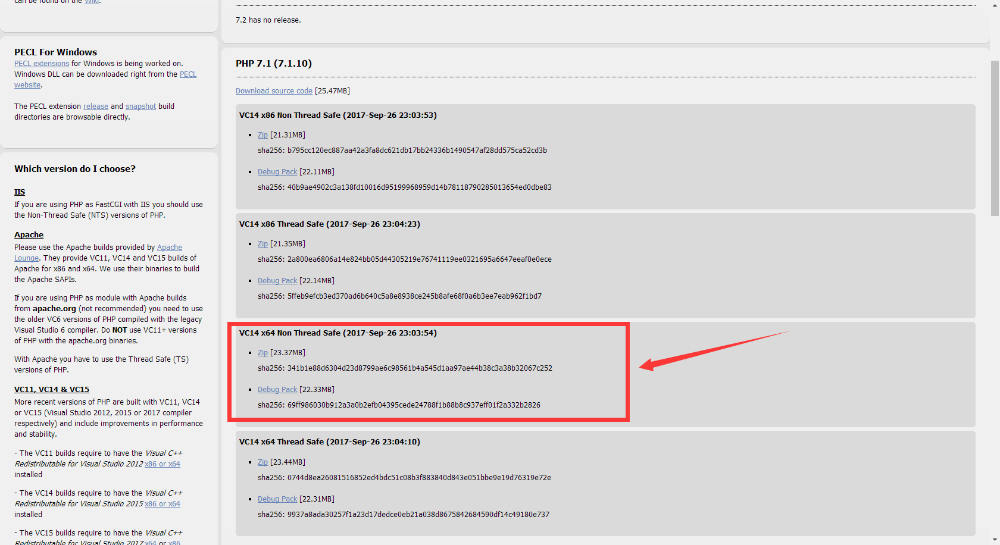
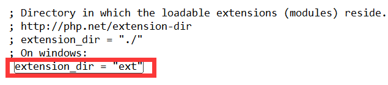
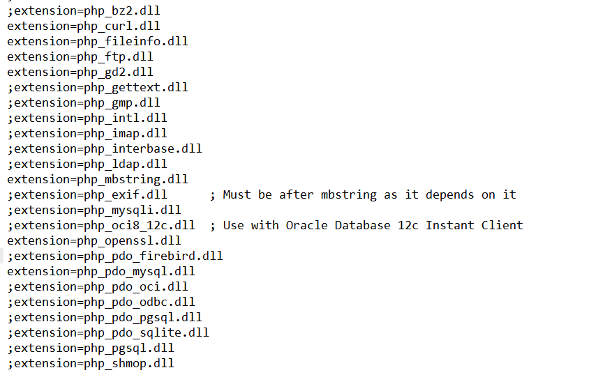

# PHP升级安装7.1.10（windows phpStudy）

## 1、下载安装包
##### 前往官网下载windows的zip包，下载地址：
> http://windows.php.net/download#php-7.1

> TS指Thread Safety，即线程安全，一般在IIS以ISAPI方式加载的时候选择这个版本。
> NTS即None-Thread Safe，一般以fast cgi方式运行的时候选择这个版本，具有更好的性能。

>具体：
 从2000年10月20日发布的第一个Windows版的PHP3.0.17开始的都是线程安全的版本，这是由于与Linux/Unix系统是采用多进程的工作方式不同的是Windows系统是采用多线程的工作方式。如果在IIS下以CGI方式运行PHP会非常慢，这是由于CGI模式是建立在多进程的基础之上的，而非多线程。一般我们会把PHP配置成以ISAPI的方式来运行，ISAPI是多线程的方式，这样就快多了。但存在一个问题，很多常用的PHP扩展是以Linux/Unix的多进程思想来开发的，这些扩展在ISAPI的方式运行时就会出错搞垮IIS。因此在IIS下CGI模式才是 PHP运行的最安全方式，但CGI模式对于每个HTTP请求都需要重新加载和卸载整个PHP环境，其消耗是巨大的。
 为了兼顾IIS下PHP的效率和安全，微软给出了FastCGI的解决方案。FastCGI可以让PHP的进程重复利用而不是每一个新的请求就重开一个进程。同时FastCGI也可以允许几个进程同时执行。这样既解决了CGI进程模式消耗太大的问题，又利用上了CGI进程模式不存在线程安全问题的优势。
 因此：
 如果是使用ISAPI的方式来运行PHP就必须用Thread Safe(线程安全)的版本；
 而用FastCGI模式运行PHP的话就没有必要用线程安全检查了，用None Thread Safe(NTS，非线程安全)的版本能够更好的提高效率。
##### 通过上面了解我选择如下非线程安全版本

##### 下载完成解压放至安装目录（如：D:\phpStudy\php）
##### 重命名文件夹为php-7.1.10-nts
## 2、配置文件php.ini
#### 进入php安装目录（如：cd D:\phpStudy\php\php-7.1.10-nts）
#### 复制php.ini-development为php.ini并修改以下内容:
```ini
#开启php扩展存放目录
extension_dir = "ext"
```


## 3、添加php环境变量

#### php7.1.10安装完成


