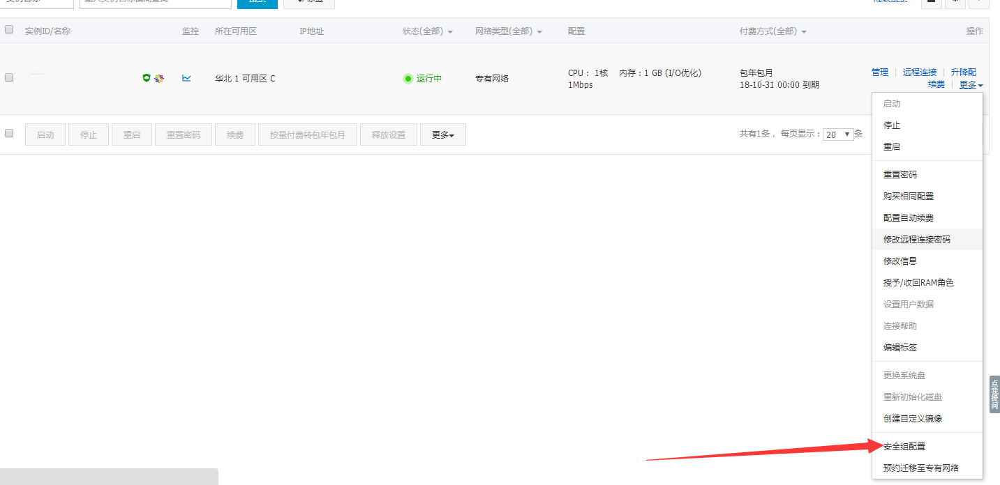
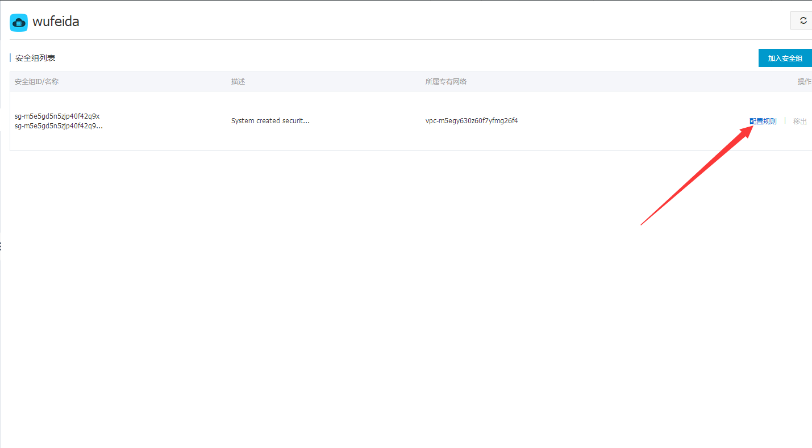
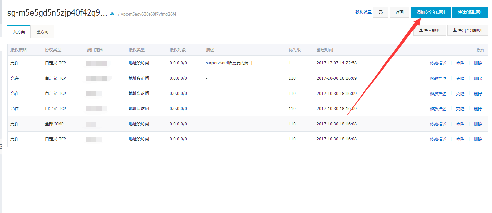
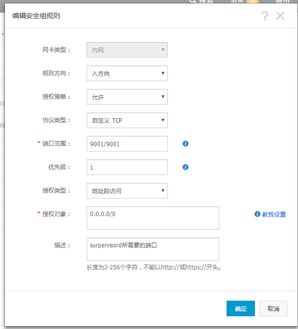
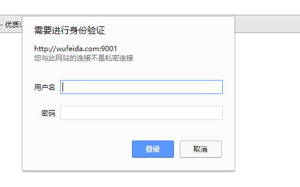
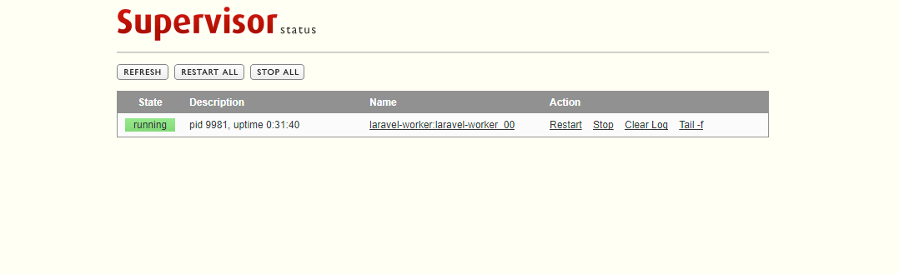

# Centos7 Supervisor的安装
#### Supervisor (http://supervisord.org) 是一个用 Python 写的进程管理工具，可以很方便的用来启动、重启、关闭进程（不仅仅是 Python 进程）。除了对单个进程的控制，还可以同时启动、关闭多个进程，比如很不幸的服务器出问题导致所有应用程序都被杀死，此时可以用 supervisor 同时启动所有应用程序而不是一个一个地敲命令启动。

## 1、安装
#### 我们使用文档推荐的方式安装，需要下载 ``setuptools``这个工具，关于这个工具的解释，可以参考这个网站（http://peak.telecommunity.com/DevCenter/setuptools）
```cmd
yum install python-setuptools
```
#### ``setuptools``安装完成后，接着下载安装 ``supervisor``,执行如下命令：
```cmd
easy_install supervisor
```
#### 测试是否安装成功,我们这里可以运行 ``echo_supervisord_conf``命令,输出默认的配置项：
```cmd
echo_supervisord_conf
```
#### 部分内容如下：
```cmd
; Sample supervisor config file.
;
; For more information on the config file, please see:
; http://supervisord.org/configuration.html
;
; Notes:
;  - Shell expansion ("~" or "$HOME") is not supported.  Environment
;    variables can be expanded using this syntax: "%(ENV_HOME)s".
;  - Quotes around values are not supported, except in the case of
;    the environment= options as shown below.
;  - Comments must have a leading space: "a=b ;comment" not "a=b;comment".
;  - Command will be truncated if it looks like a config file comment, e.g.
;    "command=bash -c 'foo ; bar'" will truncate to "command=bash -c 'foo ".

[unix_http_server]
file=/tmp/supervisor.sock   ; the path to the socket file
;chmod=0700                 ; socket file mode (default 0700)
;chown=nobody:nogroup       ; socket file uid:gid owner
;username=user              ; default is no username (open server)
;password=123               ; default is no password (open server)

;[inet_http_server]         ; inet (TCP) server disabled by default
;port=127.0.0.1:9001        ; ip_address:port specifier, *:port for all iface
;username=user              ; default is no username (open server)
;password=123               ; default is no password (open server)

[supervisord]
logfile=/tmp/supervisord.log ; main log file; default $CWD/supervisord.log
logfile_maxbytes=50MB        ; max main logfile bytes b4 rotation; default 50MB
logfile_backups=10           ; # of main logfile backups; 0 means none, default 10
loglevel=info                ; log level; default info; others: debug,warn,trace
pidfile=/tmp/supervisord.pid ; supervisord pidfile; default supervisord.pid
nodaemon=false               ; start in foreground if true; default false
minfds=1024                  ; min. avail startup file descriptors; default 1024
minprocs=200                 ; min. avail process descriptors;default 200
;umask=022                   ; process file creation umask; default 022
;user=chrism                 ; default is current user, required if root
;identifier=supervisor       ; supervisord identifier, default is 'supervisor'
;directory=/tmp              ; default is not to cd during start
;nocleanup=true              ; don't clean up tempfiles at start; default false
;childlogdir=/tmp            ; 'AUTO' child log dir, default $TEMP
;environment=KEY="value"     ; key value pairs to add to environment
;strip_ansi=false            ; strip ansi escape codes in logs; def. false

; The rpcinterface:supervisor section must remain in the config file for
; RPC (supervisorctl/web interface) to work.  Additional interfaces may be
; added by defining them in separate [rpcinterface:x] sections.
 ...
```
#### 看到以上内容就代表安装成功。
## 2、创建配置文件
#### 创建supervisor配置文件目录/etc/supervisor/
```cmd
mkdir -m 755 -p /etc/supervisor/
```
####  ``echo_supervisord_conf`` 命令可以输出默认的配置项，我们这里将内容重定向到配置文件里``supervisord.conf``：
```cmd
echo_supervisord_conf > /etc/supervisor/supervisord.conf
```
#### 接着我们创建任务存放目录``/etc/supervisor/conf.d``
```cmd
mkdir -m 755 conf.d
```
#### 在/etc/supervisor/conf.d创建一个任务，这里以php laravel框架监听队列任务为例，创建一个``laravel-work.conf``文件：
```cmd
[program:laravel-worker]
process_name=%(program_name)s_%(process_num)02d ;进程名称
command=php /home/wwwroot/blog/artisan queue:work database --sleep=3 --tries=3 --daemon ;需要执行的命令
autostart=true ; 在 supervisord 启动的时候也自动启动
autorestart=true ; 程序异常退出后自动重启
user=root ; 用哪个用户启动
redirect_stderr=true ; 把 stderr 重定向到 stdout，默认 false
stdout_logfile=/home/wwwlogs/blog/worker.log ; stdout 日志文件,需要注意当指定目录不存在时无法正常启动，所以需要手动创建目录（supervisord 会自动创建日志文件）
```
#### 在主配置文件中引入该文件，配置如下：
```cmd
 ...
[include]
files = conf.d/*.conf ;引入conf.d下的所有.conf的配置文件
```
#### 启动supervisor
```cmd
supervisord -c /etc/supervisor/supervisord.conf
```
#### 查看supervisor日志
```cmd
cat /tmp/supervisord.log
```


#### 内容如下：
```cmd
2017-12-07 13:56:01,180 CRIT Supervisor running as root (no user in config file)
2017-12-07 13:56:01,180 INFO Included extra file "/etc/supervisor/conf.d/laravel-work.conf" during parsing
2017-12-07 13:56:01,187 INFO RPC interface 'supervisor' initialized
2017-12-07 13:56:01,187 CRIT Server 'unix_http_server' running without any HTTP authentication checking
2017-12-07 13:56:01,188 INFO daemonizing the supervisord process
2017-12-07 13:56:01,188 INFO supervisord started with pid 9823
2017-12-07 13:56:02,190 INFO spawned: 'laravel-worker_00' with pid 9825
2017-12-07 13:56:03,192 INFO success: laravel-worker_00 entered RUNNING state, process has stayed up for > than 1 seconds (startsecs)

```
#### 还可以通过命令``pstree``来查看``supervisor``是否启动成功
```cmd
pstree
```
#### 内容如下：
```cmd
 ├─supervisord───php
```
#### 由此可以看出已经成功启动！
## 3、管理进程
#### 用 ``supervisorctl`` 查看已经被监控的program
```cmd
supervisorctl -c /etc/supervisor/supervisord.conf
```
#### 在该命令行中可执行start、stop、status、reload等操作。来管理进程的开始，停止，和重载等。
#### 每次修改配置文件后需进入supervisorctl，执行reload， 改动部分才能生效
## 4、通过web访问管理
#### supervisor提供了一种可以通过web管理进程的方式，我感觉这个功能有点鸡肋，但是对于没有条件进入服务器管理的同学还是有一定帮助的，我们这里也讲一下。
#### 我们仍然需要修改配置文件``/etc/supervisor/supervisord.conf``,修改``[inet_http_server]``段的相关配置，内容如下：
```cmd
[inet_http_server]         ; inet (TCP) server disabled by default
port=*:9001
;port=127.0.0.1:9001        ; ip_address:port specifier, *:port for all iface
username=user              ; 登录用户名
password=123               ; 登录密码
```
#### 保存退出后，进入supervisorctl，执行reload,重新载入配置文件即可。
#### 这里需要注意一下，我改完并重载后用``http://ip:9001``没有进去，由于这里需要外网访问，我用的是阿里服务器，就需要到阿里控制台去开启``9001``端口，




#### 保存之后，重新访问``http://ip:9001``，提示输入用户名和密码，这里输入的是刚刚配置文件``/etc/supervisor/supervisord.conf``填写的用户名和密码，正确后成功进入web管理页面。



#### 至此，supervisor安装配置全部完成！
