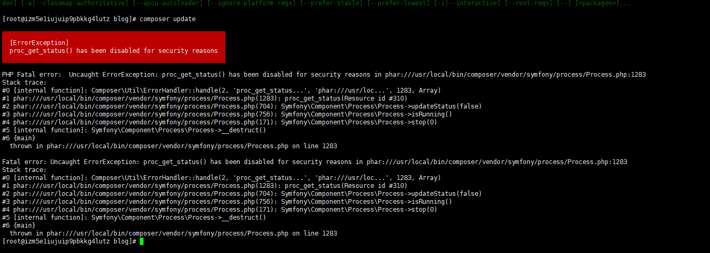

# Laravel项目部署时遇到的问题
#### 部署个人博客系统时遇到的问题，记录一下，以便再次遇到时快速解决。

## 1、composer命令行需要开启的一些php函数
#### 由于我用的是一个全新的服务器，配置都是默认的，直接执行composer的时候，报了一些错误：
#### 1)首先映入眼帘的是``proc_open``这个函数错误：


```cmd
The Process class relies on proc_open, which is not available on your PHP installation.
```
#### ``proc_open`` 这个函数就是php用来和shell交互的函数，一般这种可以直接作用于操作系统的函数是非常不安全的，对于这种不安全的函数，``php.ini``默认是禁用的
#### 解决方法是去``php.ini``这个配置文件里找到``disable_functions ``,将``proc_open``这个函数删掉就可以了。
```cmd
disable_functions = passthru,exec,system,chroot,chgrp,chown,shell_exec,proc_open,proc_get_status,popen,ini_alter,ini_restore,dl,openlog,syslog,readlink,symlink,popepassthru
```
#### 2)当我把``proc_open``这个函数从禁用列表删除后，再次运行``composer update`` ,composer也预料之中的再次报错，好尴尬，``proc_get_status``这个函数的问题：

#### ``proc_get_status`` 获取由 ``proc_open()`` 函数打开的进程的信息，所以这个也是非常不安全的函数，也是默认被禁用的。
#### 这个的解决方法同上，在``php.ini``这个配置文件里找到``disable_functions ``,将``proc_get_status``这个函数删掉就可以了。

#### 再次运行``composer update``,顺利完成，composer暂时先告一段落。
#### 3)小结：composer 要开启的函数，
```cmd
proc_open, proc_get_status
```
## 2、配置数据库后，运行迁移出错。
#### 当我在``.env``配置完数据库后，运行``php artisan migrate``时，报下面这个错误：
```cmd
[Illuminate\Database\QueryException]
SQLSTATE[42000]: Syntax error or access violation: 1071 Specified key was too long; max key length is 767 bytes (SQL: alter table users add unique users_email_unique(email))

[PDOException]
SQLSTATE[42000]: Syntax error or access violation: 1071 Specified key was too long; max key length is 767 bytes
```
#### Laravel 5.4以后默认使用utf8mb4字符编码，而不是之前的utf8编码。因此运行php artisan migrate 会出现以上错误。
#### 问题根源：
#### MySql支持的utf8编码最大字符长度为3字节，如果遇到4字节的宽字符就会出现插入异常。三个字节UTF-8最大能编码的Unicode字符是0xffff，即Unicode中的基本多文种平面（BMP）。因而包括Emoji表情（Emoji是一种特殊的Unicode编码）在内的非基本多文种平面的Unicode字符都无法使用MySql的utf8字符集存储。
#### 这也应该就是Laravel 5.4改用4字节长度的utf8mb4字符编码的原因之一。不过要注意的是，只有MySql 5.5.3版本以后才开始支持utf8mb4字符编码（查看版本：``selection version();`` ）。如果MySql版本过低，需要进行版本更新。
#### 解决方法：
#### 1)升级MySql版本到5.5.3以上。
#### 2)手动配置迁移命令migrate生成的默认字符串长度，在``AppServiceProvider``中调用``Schema::defaultStringLength``方法来实现配置：
```php
use Illuminate\Support\Facades\Schema;

/**
* Bootstrap any application services.
*
* @return void
*/
public function boot()
{
   Schema::defaultStringLength(191);
}
```
#### 修改之后再次进行迁移 ``php artisan migrate``,顺利完成。
## 3、绑定域名后访问，报500的错误 (lnmp防跨目录设置)
#### 进入配置文件打开错误日志后看到如下错误：
```cmd
FastCGI sent in stderr: "PHP message: PHP Warning:  require(): open_basedir restriction in effect. File(/home/wwwroot/blog/vendor/autoload.php) is not within the allowed path(s): (/home/wwwroot/blog/public/:/tmp/:/proc/) in /home/wwwroot/blog/public/index.php on line 24
PHP message: PHP Warning:  require(/home/wwwroot/blog/vendor/autoload.php): failed to open stream: Operation not permitted in /home/wwwroot/blog/public/index.php on line 24
PHP message: PHP Fatal error:  require(): Failed opening required '/home/wwwroot/blog/public/../vendor/autoload.php' (include_path='.:/usr/local/php/lib/php') in /home/wwwroot/blog/public/index.php on line 24" while reading response header from upstream, client: 114.242.17.66, server: wufeida.com, request: "GET / HTTP/1.1", upstream: "fastcgi://unix:/tmp/php-cgi.sock:", host: "wufeida.com"
```
#### 经过查询网上各个坑友踩过得坑，有以下几种解决方法：
#### 1) 如果你是使用 ``lnmp vhost add`` 命令 添加的虚拟域名会在根目录生成 ``.user.ini`` 这个文件，这个文件的作用就是设置限制访问的目录或删除来移除防跨目录的设置，通俗的讲就是防止程序随便访问自己项目外面的文件，严重威胁服务器的安全。
#### 解决方法：
#### 删除或修改 ``.user.ini`` 这个文件，``.user.ini`` 文件无法直接修改，如要修或删除需要先执行：``chattr -i /网站目录/.user.ini``。
```cmd
chattr -i /网站目录/.user.ini
rm -f /网站目录/.user.ini
```
#### ``.user.ini`` 不需要重启一般5分钟左右生效，也可以重启一下``php-fpm`` 立即生效。
#### 2) LNMP 1.4上如果不想用防跨目录或者修改``.user.ini`` 的防跨目录的目录还需要将 ``/usr/local/nginx/conf/fastcgi.conf`` 里面的 ``fastcgi_param PHP_ADMIN_VALUE "open_basedir=$document_root/:/tmp/:/proc/";`` 在该行行前添加 # 或删除改行，需要重启nginx。
## 4、需要给 ``storage``写权限
```cmd
chmod -R 777 storage
```
## 5、生成laravel的应用密钥
```cmd
 php artisan key:generate
```
## 6、laravel运行自定义命令时的错误
#### 项目里面有自定义的命令，用来生成管理员 ``php artisan blog:admin``，执行自定义命令时报错，由于都是php默认禁用的函数引起的，和第一项的错误大同小异（composer命令行需要开启的一些php函数），这里只说一下要删除的函数：
```cmd
exec,shell_exec,symlink(这个是生成软链时候报错)
```
#### 至此，项目正常运行！